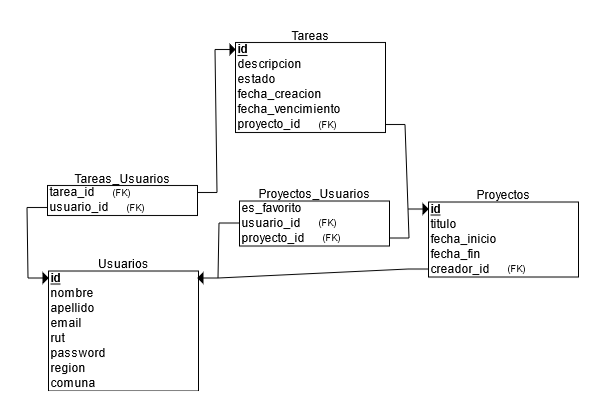
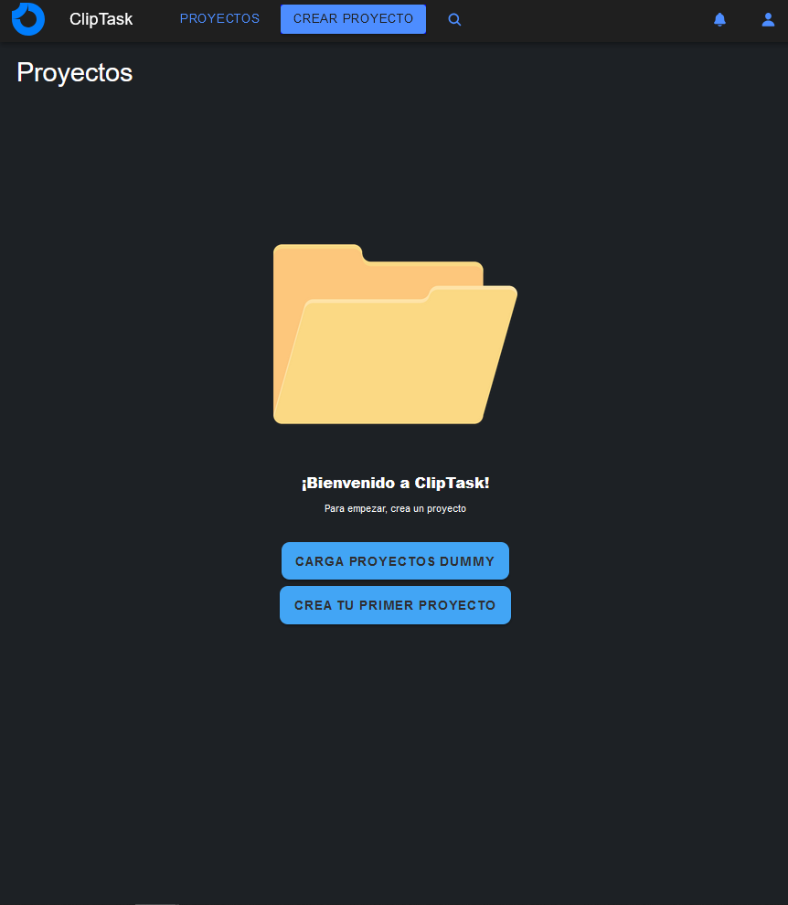
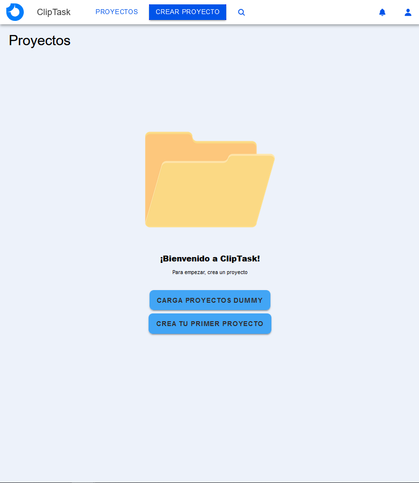
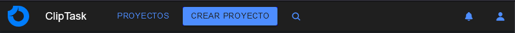
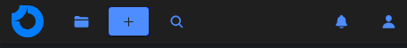
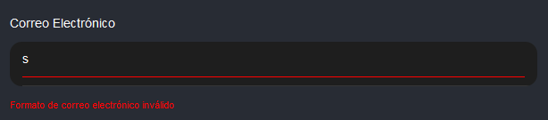
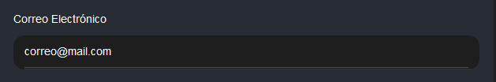
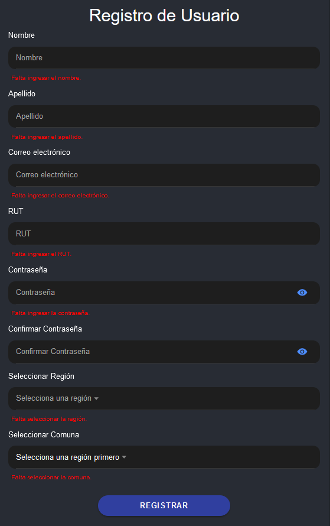

# Proyecto Web Movil: ClipTask

Proyecto INF3245

La aplicación permitirá a los usuarios gestionar tareas dentro de proyectos colaborativos en tiempo real. Se enfocará en facilitar la organización y el seguimiento de tareas en equipos de trabajo, con notificaciones instantáneas y un sistema de roles para gestionar permisos y responsabilidades.

## [Entrega Parcial 1 (01-09-2024)](https://github.com/Gabu32/ProyectoWebMovil/tree/EP1)

## Entrega Parcial 2 (25-10-2024)

## Tabla de Contenidos

1. [Implementación de 7 mockups UI en framework Ionic](#ui)
2. [Lectura de datos desde archivo JSON](#lecturajson)
3. [Modelo de base de datos](#db)
4. [Patrones de diseño](#patronesdediseño)

# UI Ionic

## 1. Landing ([/landing](Ep2/Front-End/src/pages/Landing/Landing.tsx)):

Página de inicio para nuevos usuarios. Destaca las funcionalidades de la app y las opciones de Inicio y Registro.

## 2. Home ([/home](EP2/Front-End/src/pages/Home.tsx)):

Página de inicio para usuarios registrados. Entrega una vista rápida de los proyectos y tareas pendientes del usuario. Para esta entrega se desactivó la lógica de autenticación debido a que no se solicitaba.

## 3. ProjectList ([/projects](EP2/Front-End/src/pages/ProjectList/ProjectsList.tsx))

Página donde se listan los proyectos del usuario. En caso de no tener la página es distinta. Se deshabilitó la lógica de cargar los proyectos desde la DB puesto que no se solicitaba para esta entrega. Se agregó un botón de dummy para probar las 2 versiones.

## 4. CreateProject ([/create-project](EP2/Front-End/src/pages/CreateProject/CreateProject.tsx))

Página de creación de proyectos. Se desactivó lógica de agregar a DB.

## 5. ProjectPage ([/project](EP2/Front-End/src/pages/ProjectPage/ProjectPage.tsx))

Página de proyecto. Se tienen 3 tabs: Tareas, Cronograma, Equipo. El tab de tareas lista las tareas pendientes y completadas. El cronograma mostrará las fechas de cada tarea y el listado de tareas ya completadas. El tab de equipo muestra a los integrantes del proyecto y sus roles.

## 6. CreateTask ([/create-task](EP2/Front-End/src/pages/CreateTask/CreateTask.tsx))

Página de creación de tareas. Falta implementar la lógica para agregar a DB.

## 7. TaskPage ([/task](EP2/Front-End/src/pages/TaskPage/TaskPage.tsx))

Página de tarea. Se descripción, usuarios asignados, fechas de inicio-término y comentarios.

## 8. Notifications ([/notifications](EP2/Front-End/src/pages/Notifications/Notifications.tsx))

Página de notificaciones. Para esta entrega se agregó un botón para mostrar ambas versiones de la pantalla (con y sin notificaciones).

# Lectura Archivos JSON {#lectura-json}

Se realiza una lectura desde un archivo JSON en el registro. Se leen las regiones y comunas desde el archivo [/comunas-regiones.json](EP2/Front-End/public/comunas-regiones.json)

# Modelo de Base de Datos {#db}

### Modelo Entidad-Relación

Hemos optado por utilizar una base de datos relacional para nuestro proyecto debido a varias razones. Primero, el tamaño de nuestro proyecto es pequeño, lo que significa que no tenemos que preocuparnos de la escalibilidad del sistema. Además, este tipo de de BD son un estándar en el desarrollo web. Por último, consideramos la familiaridad de los desarrolladores con este tipo de BD y la claridad en la estrucutura de los datos.

Se adjunta el script de creación de tablas y un modelo entidad-relación de la BD.

Script creación de tablas: [create.sql](/EP2/create.sql)

# Patrones de diseño

A continuación se presentan algunos de los patrones de diseño utilizados en este proyecto y ejemplos:

### Modo claro y modo oscuro

Las imágenes muestran la página en sus modos claro y oscuro (testeado con un navegador Firefox según las preferencias del navegador), ofreciendo a los usuarios una opción de visualización según sus preferencias.

### Diseño responsivo en el header

Las siguientes imágenes ilustran cómo el diseño del header cambia en dispositivos móviles (dispositivos con menos de 700px de ancho), garantizando una buena experiencia de usuario en pantallas pequeñas.

Header en modo desktop

Header en modo móvil

### Mensajes de error

En las imágenes de muestran ejemplos de los mensajes de error durante los procesos de Login y Registro. Estos mensajes están diseñados para ser claros y útiles.

